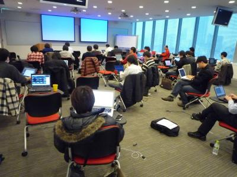
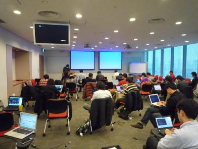
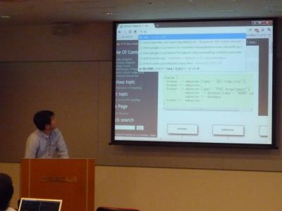

Sphinx翻訳ハッカソン イベントレポート(2011/2/12)
=================================================

:日時: 2011/2/12 11:00～19:00
:場所: `オラクル青山センター 13F(東京都港区北青山2-5-8)`__

.. __: http://www.oracle.co.jp/aoyamacenter/

ソフトウェアのドキュメントに興味のある人が集まって、みんなで翻訳しよう、というイベントです。

なお、翻訳するものは問いませんし、Sphinxを使わなくてもOKです。また、一人でやっても、グループでやってもOK。
一人では辛くてすぐ飽きちゃう活動も、みんなと一緒ならがんばれる！というのが目的です。
また、翻訳とは関係なく、Sphinxを使ってみたい、という人でも歓迎です。

今回のイベントは25名の方々が翻訳したりSphinx利用の練習をしたりしていました。
PyCon mini JP でSphinxに言及した発表やLTが多かったために参加者が増えたのか、
あるいは、ついにSphinxの人気が爆発したのかは分かりません。
また、参加者の半数近くがPythonではなくPHP利用者だったのも今までとは異なる感じで非常に面白い会だったと思います。

今回は会場にオラクルさんをお借りすることが出来たため、プロジェクターを使用して渋川さんがSphinxの導入セッションを行ったり、
午後には突発的にいくつかの発表が行われたりもしました。

会計報告
---------

会の途中で Sphinx-users.jp の会計報告がありました。
ドメイン代は2010/10に2年分払っており、次回支払いは2012年10月予定です。

.. list-table::
   :header-rows: 1
 
   - *
     * 収入
     * 支出
   - * 2010年残金
     * 2500
     *
   - * 2011/3/4 OSC東京春 資料印刷
     * 
     * 3000
   - * 2011/6/18 JUS関西講演謝礼
     * 5000
     *
   - * 2011/11/30 InternetWeek2011講演謝礼
     * 5000
     *
   - * 2012年活動への繰越
     * 
     * 9500

会の様子
---------
どのようにイベントが進められていったのか、写真を交えつつご紹介します。

    みなさん黙々と開発しています

    blockdiagの紹介 @tk0miya

    ダイアログ図作成ツール blockdiag についての紹介を行いました。内容は PyCon mini JP でのものと同じですが、さらに深い内容をプレゼンしてくれました。

    いろいろな人に使って欲しい、いろいろな要望やフィードバックをもらえるとうれしい、ということでした。 @tk0miya まで日本語で連絡お願いします。

