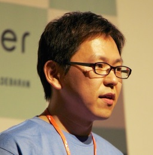

==============================
Sphinx ハンズオン PyConJP 2015
==============================

.. s6:: styles

    'h1': {fontSize:'180%', textAlign:'center', lineHeight:'3em'}

講師紹介: @shimizukawa
========================

* Takayuki Shimizukawa
* Sphinx-users.jp 運営
* Sphinx 開発者のひとり

.. s6:: styles

    'img': {float:'right', margin:'0.5em'}

講師紹介: @shibukawa
=====================

* Yoshiki Shibukawa
* Sphinx-users.jpのファウンダーです

.. s6:: styles

    'img': {float:'right', margin:'0.5em'}

講師紹介: @kk_Ataka
====================

* Yosuke ATAKA
* SIer勤務
* 業務にSphinxを導入できないか試行錯誤中

.. s6:: styles

    'img': {float:'right', margin:'0.5em'}

ハンズオンの内容
=================

* インストール
* Sphinx-quickstart を実行する
* ビルドしてみる（HTML）
* 基礎的なマークアップを書いて変換してみる
* Sphinx リファレンスの読み方
* その他質問大会

ハンズオンの進め方
===================
* 現時点での理解度を元にチーム分けします
* チームごとに進めます
* おしまい

困ったときには
===============
* 手をあげよう
* まわりの人に聞こう

チーム分け
===========
* インストールしてない人
* ちょっと試してみた人
* もう使っている人

おおざっぱなタイムスケジュール
===============================
* 10:00- 開会式 ← いまココ
* 10:10- Sphinxの紹介
* 10:20- ハンズオン(前半)
* 11:20- 休憩
* 11:30- ハンズオン(後半)
* 12:30- まとめ
* 13:00  撤収

会場からの連絡
===============
* タバコは休憩時間に。(外です)
* 無線LAN
* 飲食可です
* ハッシュタグ #sphinxjp
* 写真班が撮影して回ります
   * 撮られたくない人は教えてください

Sphinx紹介
===========

.. s6:: styles

   'h2': {textAlign:'center', margin:'30% auto'}

ハンズオンタイム
=================
.. * セクション、箇条書き、太字、斜体、リンク、code-block、テーブル、画像、複数のファイルをリンク(toctree)

.. s6:: styles

   'h2': {textAlign:'center', margin:'30% auto'}

ハンズオン
===========

* 基礎的なマークアップを書いて変換
* Sphinx リファレンスの読み方
* その他質問大会

参考資料

* http://sphinx-users.jp
* http://docs.sphinx-users.jp/

今日やったこと
===============
* インストール (一部の人)
* Sphinx-quickstart を実行する
* ビルドしてみる（HTML）
* 基礎的なマークアップを書いて変換してみる
* Sphinx リファレンスの読み方
* その他質問大会

.. * わからなくなったときの助けの呼び方

わからなかったことありますか?
==============================
* 挙手
* 困ったときには
   * メーリングリスト
   * #sphinxjp タグ
   * 聞きたい/知りたいことも投げてください

.. s6:: styles

    'ul/li[1]': {display:'none'}

.. s6:: actions

    ['ul/li[1]', 'fade in', '0.3'],

参考資料
===========
* http://sphinx-users.jp/
* http://docs.sphinx-users.jp/
* 今日の資料
   * すべて Sphinx で作られています
   * sphinxjp.themes.s6 テーマを使ってます。
   * https://bitbucket.org/sphinxjp/handson/src

参考書籍
==========

* Sphinxをはじめよう (オライリー)
* Software Design (技術評論社) 2015年4月～連載

宣伝
=====
* Sphinx & 翻訳 hack-a-thon
   * ほぼ毎月開催します(次は10/12)
   * Sphinx をつかったもくもく会
* 他なにかある?

おねがい
=========
* 周りに広めよう
* 使ってみましょう
* とりあえず Sphinx-users.jp に参加しよう

おしまい
=========
* あと片付けして帰りましょう
* ゴミはゴミ箱へ
* 午後も参加する人はお弁当があります

